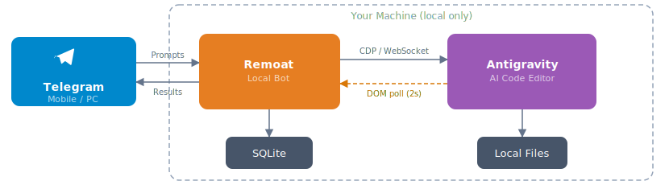

<p align="center" style="margin-bottom:0">
  
</p>
<h1 align="center" style="margin-top:0">Remoat</h1>

<p align="center">
  <strong>Control your AI coding assistant from anywhere — right from Telegram.</strong>
</p>

<p align="center">
  <a href="https://github.com/optimistengineer/Remoat/blob/main/LICENSE"></a>
  
  
</p>

---

Remoat is a **local Telegram bot** that lets you remotely operate [Antigravity](https://antigravity.dev) IDE on your PC — from your phone, tablet, or any device with Telegram.

Type a natural-language instruction, attach a screenshot, or send a voice note. Remoat dispatches it to Antigravity via Chrome DevTools Protocol, monitors progress in real time, and streams results back to Telegram. Everything runs on your machine.

## Table of Contents

- [Quick Start](#quick-start)
- [Features](#features)
- [Advanced Setup](#advanced-setup)
- [Commands](#commands)
- [Troubleshooting](#troubleshooting)
- [How It Works](#how-it-works)
- [Project Structure](#project-structure)
- [Contributing](#contributing)
- [License](#license)

## Quick Start

### Prerequisites

- [Node.js](https://nodejs.org/) 18 or higher
- [Antigravity](https://antigravity.dev) installed on your machine
- A [Telegram](https://telegram.org/) account

<details>
<summary>macOS: you'll also need Xcode Command Line Tools</summary>

Remoat uses `better-sqlite3`, a native C++ module that requires a compiler. If you don't have Xcode CLI tools installed, run:

```bash
xcode-select --install
```

You can verify they're installed with `xcode-select -p`.

</details>

### 1. Install Remoat

```bash
npm install -g remoat
```

Or with Homebrew (macOS/Linux):

```bash
brew tap optimistengineer/remoat
brew install remoat
```

### 2. Run the setup wizard

```bash
remoat setup
```

The wizard walks you through:

- **Telegram Bot Token** — Create a bot via [@BotFather](https://t.me/BotFather) on Telegram (`/newbot`), then copy the token it gives you
- **Allowed User IDs** — Only these Telegram users can control the bot. Message [@userinfobot](https://t.me/userinfobot) to get your ID
- **Workspace Directory** — The parent directory where your coding projects live (e.g. `~/Code`)

### 3. Launch Antigravity with CDP enabled

```bash
remoat open
```

> [!NOTE]
> If Antigravity is already running, quit it first and relaunch with `remoat open` — it needs the CDP debug port to be enabled.

### 4. Start the Telegram bot (in a new terminal)

```bash
remoat start
```

That's it. Open Telegram, find your bot, and start sending instructions.

<details>
<summary>Voice messages (optional): install the Whisper model</summary>

```bash
npx nodejs-whisper download
```

This pulls `base.en` (~140 MB). Requires `cmake` (`brew install cmake` on macOS, `apt install cmake` on Linux).

</details>

> Having issues? Run `remoat doctor` to diagnose your setup.

## Features

**Remote control from anywhere** — Send natural-language prompts, images, or voice notes from your phone. Antigravity executes them on your PC with full local resources.

**Project isolation via Telegram Topics** — Each project maps to a Telegram Forum Topic. All messages within a topic automatically use the correct project directory and session history — no manual context switching needed.

**Real-time progress streaming** — Long-running tasks report progress in phases (sending, thinking, complete) with a live process log and elapsed timer, streamed as Telegram messages.

**Voice input** — Hold the mic button and speak. Remoat transcribes locally via [whisper.cpp](https://github.com/ggerganov/whisper.cpp) — no cloud APIs, no Telegram Premium required.

**Approval routing** — When Antigravity asks for confirmation (file edits, plan decisions), the dialog surfaces in Telegram with inline action buttons. Or toggle `/autoaccept` to approve automatically.

**Security by design** — Whitelist-based access control. Path traversal prevention. Credentials stored locally. No webhooks, no port exposure.

## Advanced Setup

### From source

```bash
git clone https://github.com/optimistengineer/Remoat.git
cd Remoat
npm install
cp .env.example .env
```

Edit `.env` with your values:

```env
TELEGRAM_BOT_TOKEN=your_bot_token_here
ALLOWED_USER_IDS=123456789
WORKSPACE_BASE_DIR=~/Code
USE_TOPICS=true
```

> [!TIP]
> Alternatively, run `npm start -- setup` to use the interactive wizard instead of editing `.env` manually.

Then start the bot:

```bash
npm run dev       # development mode with auto-reload
# or
npm start         # run from source
```

### Launching Antigravity with CDP

Remoat connects to Antigravity via Chrome DevTools Protocol. Launch Antigravity with a debug port enabled:

```bash
remoat open       # auto-selects an available port (9222, 9223, 9333, 9444, 9555, or 9666)
```

From source, you can also use the bundled launcher scripts:

| Platform | Method |
|----------|--------|
| macOS    | Double-click `start_antigravity_mac.command` (run `chmod +x` first time) |
| Windows  | Double-click `start_antigravity_win.bat` |
| Linux    | Set `ANTIGRAVITY_PATH=/path/to/antigravity` in `.env`, then `remoat open` |

> Launch Antigravity first, then start the bot. It connects automatically.

### Forum Topics (optional)

For multi-project workflows, Remoat supports Telegram Forum Topics — each project gets its own topic thread.

1. Create a Telegram supergroup and enable **Topics** in group settings
2. Add your bot to the group with admin permissions
3. Set `USE_TOPICS=true` in `.env` (this is the default)

For simpler setups, set `USE_TOPICS=false` and use the bot in a regular chat.

## Commands

### CLI

```
remoat              auto-detect: runs setup if unconfigured, otherwise starts the bot
remoat setup        interactive setup wizard
remoat open         launch Antigravity with CDP port enabled
remoat start        start the Telegram bot
remoat doctor       diagnose configuration and connectivity issues
remoat --verbose    show debug-level logs (CDP traffic, detector events)
remoat --quiet      errors only
```

### Telegram

| Command | Description |
|---------|-------------|
| `/project` | Browse and select a project (inline keyboard) |
| `/new` | Start a new chat session in the current project |
| `/chat` | Show current session info and list all sessions |
| | |
| `/model [name]` | Switch the LLM model (e.g. `gemini-2.5-pro`, `claude-opus-4-6`) |
| `/mode` | Switch execution mode (`fast`, `plan`) |
| `/stop` | Force-stop a running Antigravity task |
| | |
| `/template` | List registered prompt templates with execute buttons |
| `/template_add <name> <prompt>` | Register a new prompt template |
| `/template_delete <name>` | Delete a template |
| | |
| `/screenshot` | Capture and send Antigravity's current screen |
| `/status` | Show connection status, active project, and current mode |
| `/autoaccept` | Toggle auto-approval of file edit dialogs |
| `/cleanup [days]` | Clean up inactive session topics (default: 7 days) |
| `/help` | Show available commands |

### Natural Language

Just type in any bound topic or direct chat:

> _refactor the auth components — see the attached screenshot for the target layout_

Or hold the mic button and speak — the voice note gets transcribed locally and sent as a prompt.

## Troubleshooting

Run diagnostics first:

```bash
remoat doctor
```

This checks your config, Node.js version, Xcode tools (macOS), Antigravity installation, and CDP port connectivity.

**`npm install` fails with `gyp ERR!` on macOS** — Install Xcode Command Line Tools: `xcode-select --install`

**`remoat open` can't find Antigravity** — The app must be in `/Applications`. If you installed it elsewhere, set `ANTIGRAVITY_PATH` in your `.env` file or environment:

```bash
export ANTIGRAVITY_PATH=/path/to/Antigravity
remoat open
```

**Bot not responding to messages** — Make sure Antigravity is running with CDP enabled (`remoat open`) before starting the bot. The bot will warn you on startup if no CDP ports are responding, but it continues running and auto-connects once Antigravity is available.

**CDP connection lost** — If you restart Antigravity, the bot auto-reconnects. Sending any message also triggers reconnection.

**Verbose logging:**

```bash
remoat --verbose      # see CDP traffic, detector events, and internal state
```

## How It Works

<p align="center">
  <a href="https://excalidraw.com/#json=a54sSDUatTXGCtJORO7GJ,muz3R_zi4nbj9RKuRAfbEA">
    
  </a>
</p>

1. You send a message in Telegram
2. Remoat authenticates it against your whitelist, resolves the project context, and injects the prompt into Antigravity via CDP
3. A response monitor polls Antigravity's DOM at 2-second intervals, detecting progress phases, approval dialogs, errors, and completion
4. Results stream back to Telegram as formatted messages

The bot never exposes a port, never forwards traffic externally, and never stores your code anywhere but your local disk.

> For a deeper dive, see [docs/ARCHITECTURE.md](docs/ARCHITECTURE.md). Click the diagram above for an [interactive version](https://excalidraw.com/#json=a54sSDUatTXGCtJORO7GJ,muz3R_zi4nbj9RKuRAfbEA).

## Project Structure

```
src/
  bin/          CLI entry point (Commander subcommands)
  bot/          grammy bot — event handling, command routing, callback queries
  commands/     Telegram slash command handlers and message parser
  services/     core business logic (CDP, response monitoring, detectors, sessions)
  database/     SQLite repositories (sessions, workspace bindings, templates, schedules)
  middleware/   auth (user ID whitelist) and input sanitization
  ui/           Telegram InlineKeyboard builders
  utils/        config, logging, formatting, i18n, path security, voice/image handling
tests/          test files mirroring src/ structure
docs/           architecture docs, DOM selector reference, diagrams
locales/        i18n translations (en, ja)
```

## Contributing

Contributions are welcome — whether it's a bug fix, a new feature, documentation improvements, or test coverage.

```bash
git clone https://github.com/optimistengineer/Remoat.git
cd Remoat
npm install
cp .env.example .env  # fill in your values
npm run dev           # start with auto-reload
npm test              # run the test suite
```

See [CONTRIBUTING.md](CONTRIBUTING.md) for the full guide — code style, commit conventions, PR process, and project architecture.

## License

[MIT](LICENSE)

## Acknowledgements

Inspired by [LazyGravity](https://github.com/tokyoweb3/LazyGravity).
