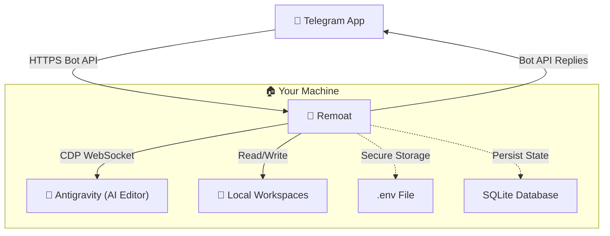

# Architecture & Core Design

## 1. System Overview
Remoat runs entirely on the user's local PC with no external server. It communicates with Telegram's Bot API over HTTPS and controls Antigravity via CDP (Chrome DevTools Protocol).



## 2. Authentication & Security
No port forwarding or webhooks required — the bot polls Telegram's API.

- **Token & Credential Management:**
  - Uses `dotenv` to load secrets from a local `.env` file. Recommend strict file permissions (e.g. `chmod 600`).
  - Only `.env.example` is committed to source control.
- **Authorization:**
  - Every incoming message and callback query is checked against the `ALLOWED_USER_IDS` whitelist before any processing.
- **Input Validation & Path Traversal Protection:**
  - All workspace path operations are resolved against `WORKSPACE_BASE_DIR` using `path.resolve` to prevent directory traversal attacks.

## 3. Project Management (Topic ↔ Project, Session ↔ Chat)
Telegram **Forum Topics = Projects**, **Sessions within topics = Chat Sessions**.

### Implemented Features
- **`/project`**: Lists subdirectories under the workspace base as inline keyboard buttons. Selecting one auto-creates a forum topic + initial session.
- **`/new`**: Starts a new Antigravity chat session within the current project topic.
- **`/chat`**: Shows the current session info and lists all sessions in the project.
- **Auto-rename**: On first message, the session topic is renamed based on the prompt content (e.g. `session-1` → `1-react-auth-bug-fix`).

### Data Flow
1. User sends `/project` → inline keyboard with project list
2. `TelegramTopicManager.ensureTopic()` creates a forum topic, `WorkspaceBindingRepository` persists topic_id ↔ workspace_path
3. `ChatSessionRepository` persists session metadata (topic ID, session number, rename state)
4. `/new` → new session in same topic + new Antigravity chat
5. First message → `TitleGeneratorService` generates title → topic renamed

### Architecture
```
src/database/workspaceBindingRepository.ts  — SQLite CRUD (workspace_bindings table)
src/database/chatSessionRepository.ts       — SQLite CRUD (chat_sessions table)
src/services/workspaceService.ts            — FS operations & path validation (scanWorkspaces, validatePath)
src/services/telegramTopicManager.ts        — Telegram Forum Topic management (ensureTopic, closeTopic)
src/services/titleGeneratorService.ts       — Topic name auto-generation (CDP + text extraction fallback)
src/services/chatSessionService.ts          — Antigravity UI operations (new chat via CDP, session info)
src/commands/workspaceCommandHandler.ts     — /project command + inline keyboard handling
src/commands/chatCommandHandler.ts          — /new, /chat commands
```

### Future Extensions
- Direct workspace switching in Antigravity via CDP (currently uses prompt prefix)
- LLM API-based title generation (currently text extraction based)

## 4. Context Preservation
Instructions and results are linked through Telegram's reply chain and SQLite state.

- **Metadata in SQLite:** Message IDs and workspace context are stored in SQLite, allowing reply-based follow-up to restore the full project context.
- **Reply-based continuation:** When a user replies to a bot message, Remoat loads the associated workspace/session context and forwards the follow-up to Antigravity.

## 5. Scheduled Tasks
- Backend implementation using `node-cron` with `ScheduleService` and `ScheduleRepository`.
- SQLite persists schedule definitions (`id`, `cron_expression`, `prompt`, `workspace_id`, `status`).
- On startup, schedules are reloaded from SQLite into in-memory cron jobs.
- Telegram `/schedule` command integration is planned.

## 6. Real-Time Progress Updates
- Remoat monitors Antigravity's output via CDP DOM polling.
- Throttled message sending (every 3-5 seconds) avoids Telegram API rate limits.
- Progress is sent as `<pre>` code blocks; final output uses full HTML formatting.

> **Details:** See [RESPONSE_MONITOR.md](./RESPONSE_MONITOR.md) for CDP-based response monitoring and process log extraction.

## 7. Antigravity Process Launch (CLI Spawn) & Resource Control
- **CLI Spawn:** Antigravity is launched as an independent background process via `child_process.spawn`.
- **Task Queue:** Concurrent task limits (per-workspace and global) prevent resource exhaustion.
- **Kill Switch:** Process PIDs are tracked; `/stop` force-kills the process tree.
- **Message Chunking:** Output exceeding Telegram's 4096-character limit is automatically split into multiple messages.
